# 拓扑服务流程图

## 1. 初始化同步流程

从 EAM 服务全量加载数据到拓扑服务。

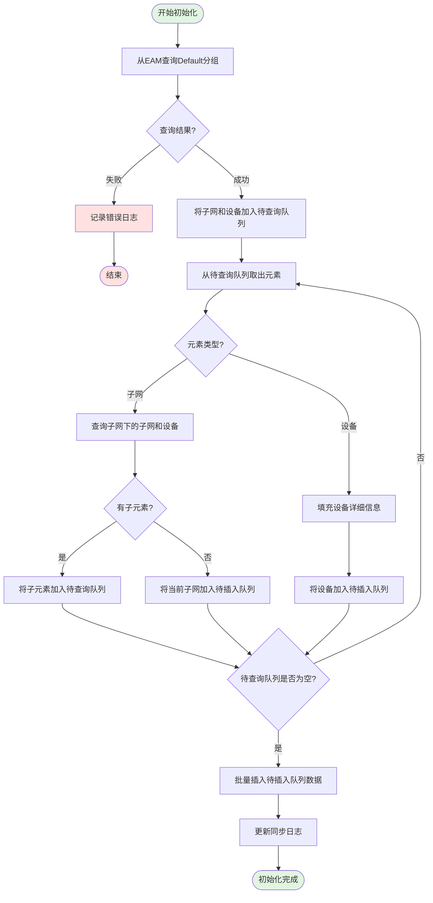

### 初始化流程说明

| 步骤 | 说明 |
|------|------|
| 1 | 调用 EAM 接口查询 Default 分组下所有子网和设备 |
| 2 | 将查询结果加入待查询队列 |
| 3 | 轮询待查询队列，递归查询子网层级结构 |
| 4 | 设备信息填充完成后加入待插入队列 |
| 5 | 队列清空后批量入库 |

---

## 2. Kafka 变更事件处理流程

监听 EAM 发送的 Kafka 变更事件。

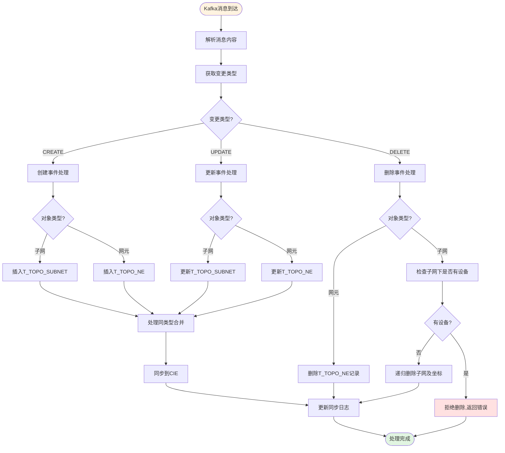

---

## 3. 同类型合并流程

开启同类型合并时的处理逻辑。

```mermaid
flowchart TD
    Start([触发合并检查]) --> A[读取合并配置]

    A --> B{MERGE_ENABLED?}
    B -->|false| End1([不处理合并])

    B -->|true| C[按父子网分组统计同类型网元]

    C --> D[遍历每个父子网+类型组合]
    D --> E{数量 >= MERGE_THRESHOLD?}

    E -->|否| D
    E -->|是| F[计算需要创建的组数]

    F --> G[组数 = ceil(数量 / 阈值)]

    G --> H[循环创建组]
    H --> H1[创建合并组子网]
    H1 --> H2[子网名称 = 类型名 + 编号]
    H2 --> H3[插入T_TOPO_SUBNET<br/>IS_MERGE_GROUP=true]

    H3 --> H4[插入T_TOPO_MERGE_GROUP]
    H4 --> H5[批量更新网元PARENT_DN]

    H5 --> I{还有组?}
    I -->|是| H
    I -->|否| J[保存坐标信息]

    J --> K[同步到CIE]
    K --> End([合并完成])

    style Start fill:#e3f2fd
    style End fill:#e1f5e1
    style End1 fill:#fff3e0
```

### 合并示例

```
假设阈值 = 10, 防火墙数量 = 25

分组结果:
├── 防火墙组1 (10个)  → 新建子网 "防火墙1"
├── 防火墙组2 (10个)  → 新建子网 "防火墙2"
└── 防火墙组3 (5个)   → 不满足阈值,保留原位置

最终:
├── Default子网
│   ├── 防火墙1 (合并组子网)
│   │   └── [10个防火墙设备]
│   ├── 防火墙2 (合并组子网)
│   │   └── [10个防火墙设备]
│   └── [5个防火墙设备] (未合并)
```

---

## 4. 同类型消除流程

从开启合并切换到关闭合并时的处理。

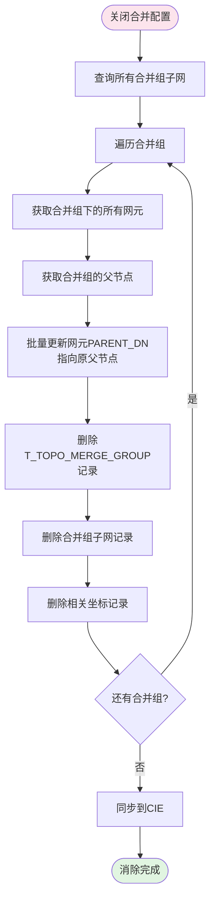

---

## 5. 子网管理流程

### 5.1 创建子网

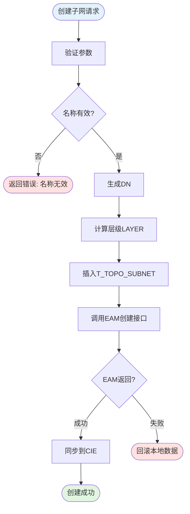

### 5.2 删除子网

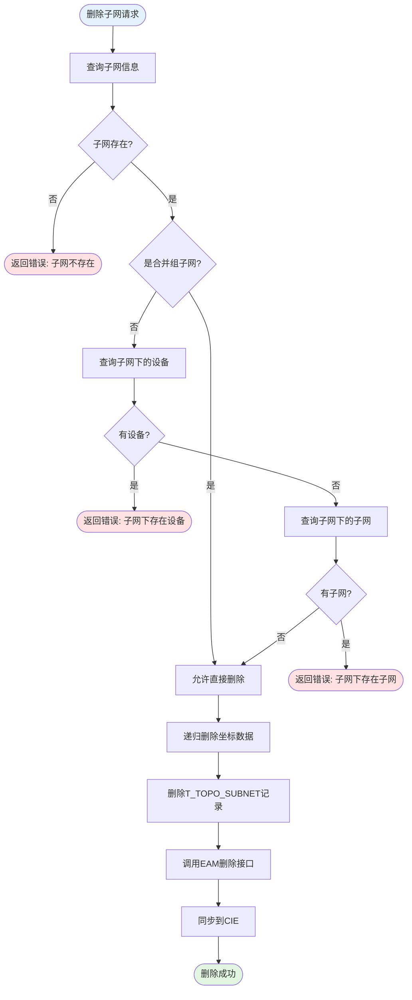

### 5.3 批量移入设备

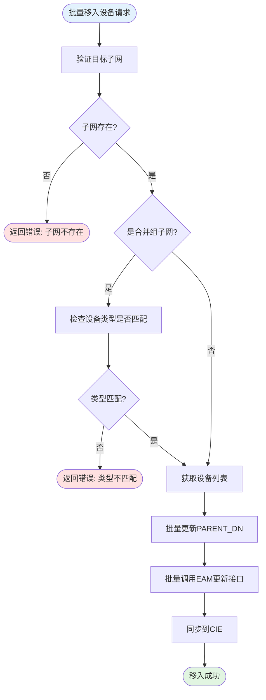

---

## 6. 坐标保存流程

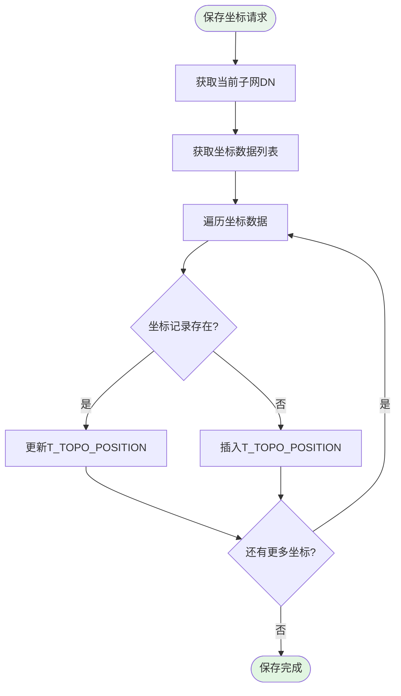

**坐标数据结构示例**:
```json
{
  "subnetDn": "DN=Default",
  "positions": [
    { "elementDn": "DN=Subnet1", "elementType": "SUBNET", "x": 100, "y": 200 },
    { "elementDn": "DN=Firewall1", "elementType": "NE", "x": 300, "y": 150 }
  ]
}
```

---

## 7. 告警统计更新流程

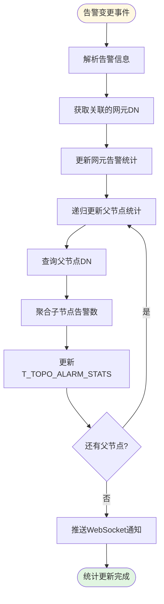

---

## 8. 自动布局流程

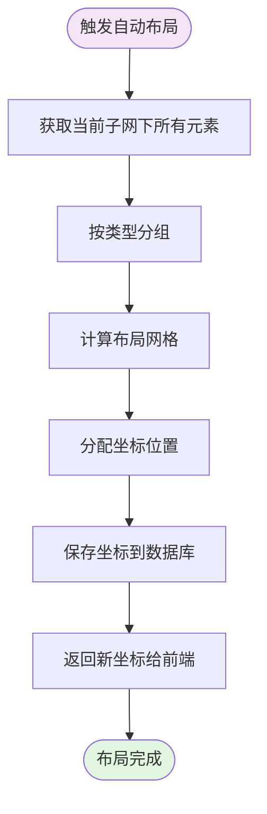

---

## 9. 整体架构流程图

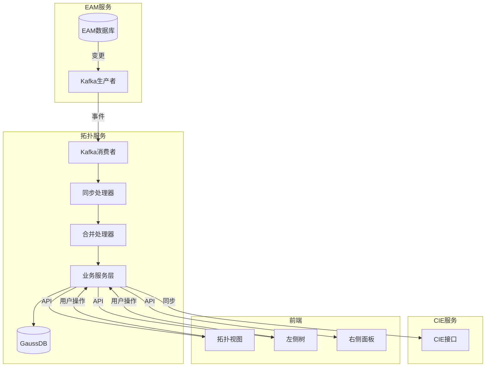

---

## 10. 状态机 - 合并配置状态

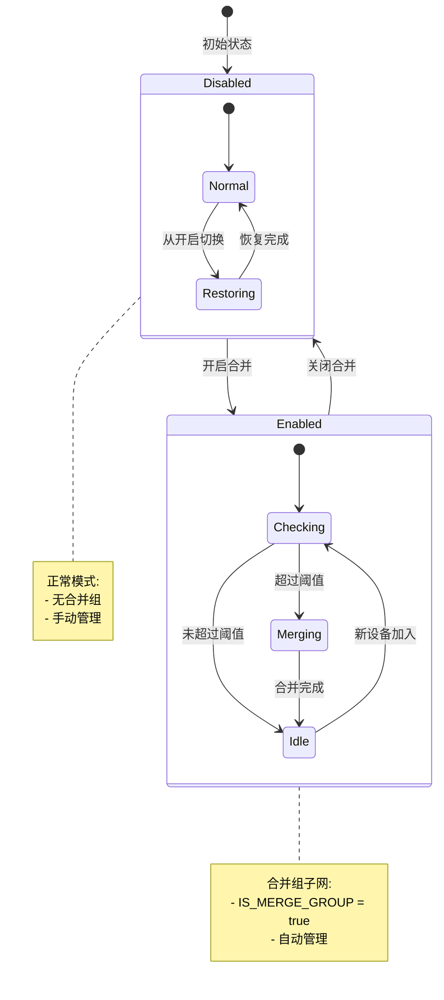
